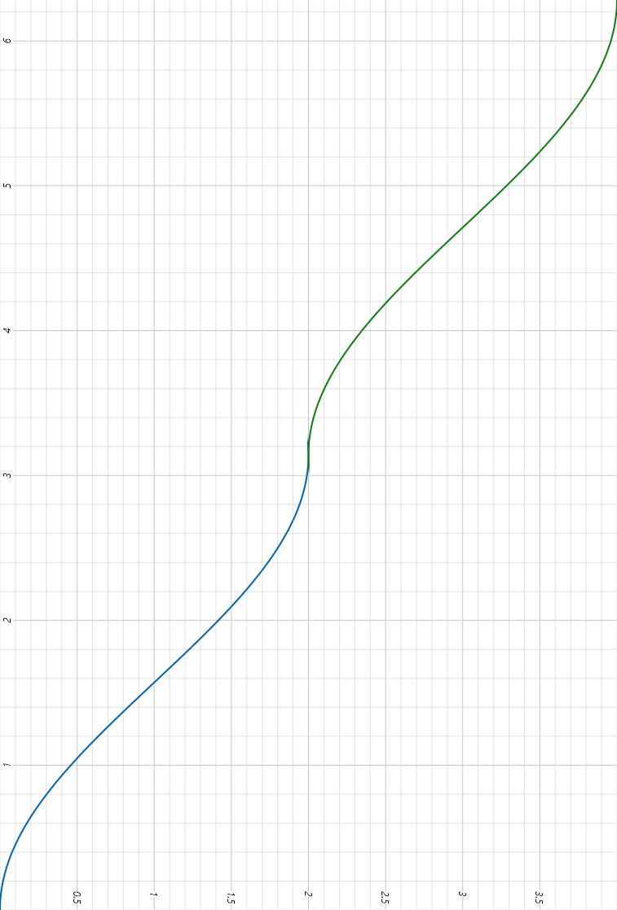
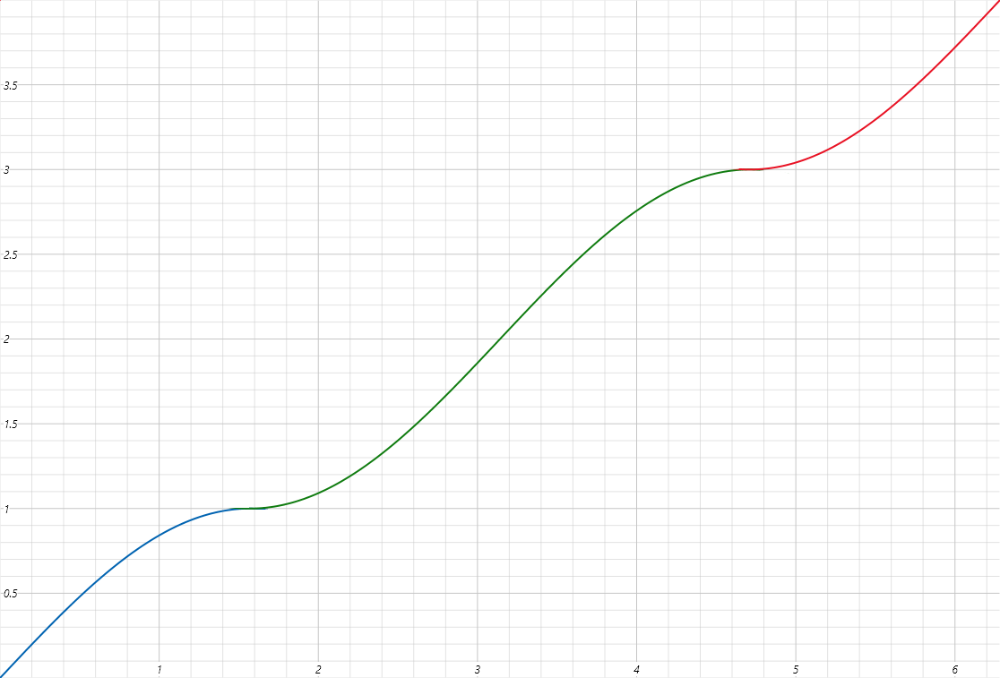
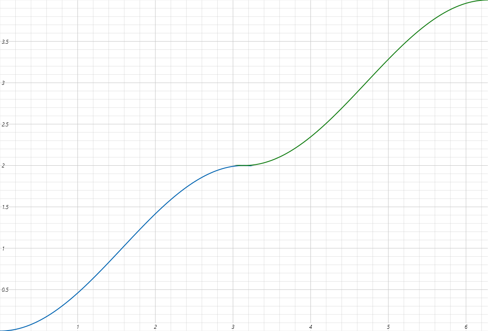
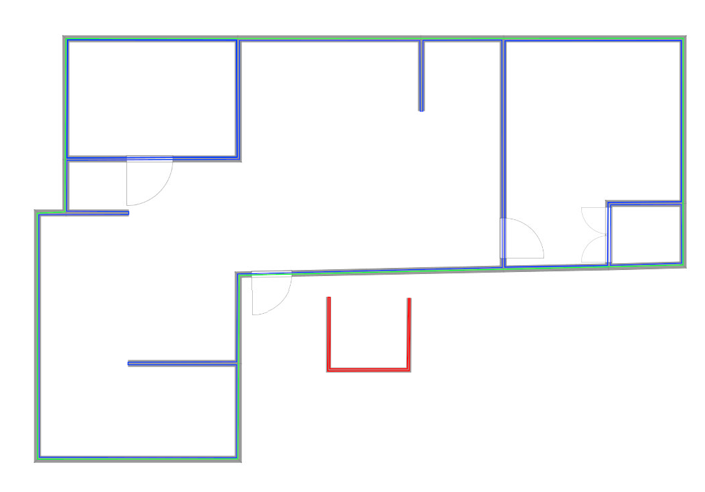

Algorithms
==========

Enumerations
------------

.. doxygenenum:: bimpp::plan2d::algorithm::room_side

Data structures
---------------

Define some data for algorithm.

.. doxygenclass:: bimpp::plan2d::algorithm::wall_ex

.. doxygenclass:: bimpp::plan2d::algorithm::node_ex

.. doxygenclass:: bimpp::plan2d::algorithm::room_ex

Functions
---------

They implement some algorithms that.

.. doxygenfunction:: bimpp::plan2d::algorithm::isContainsForBiggerVector

.. doxygenfunction:: bimpp::plan2d::algorithm::calculateAngleEx

**x-axis**: :math:`cos(\alpha)`; **y-axis**: :math:`\alpha` in radians

.. doxygenfunction:: bimpp::plan2d::algorithm::calculateSinAngleEx

**x-axis**: :math:`\alpha` in radians; **y-axis**: increased :math:`sin(\alpha)`

.. doxygenfunction:: bimpp::plan2d::algorithm::calculateCosAngleEx

**x-axis**: :math:`\alpha` in radians; **y-axis**: increased :math:`cos(\alpha)`

.. doxygenfunction:: bimpp::plan2d::algorithm::computeRoomExs

This function computes some edges of all areas that are wrapped by colourful lines.

.. role:: blue
.. role:: red
.. role:: green

* :blue:`Blue lines`: Means the `room_ex` is inside of the lines, and the `side_type` is `bimpp::plan2d::algorithm::room_side_in`.
* :red:`Red lines`: Means the `room_ex` is outside of the lines, and the `side_type` is `bimpp::plan2d::algorithm::room_side_out`.
* :green:`Green lines`: Means the `room_ex` is both inside and outside of the lines, and the `side_type` is `bimpp::plan2d::algorithm::room_side_both`.
