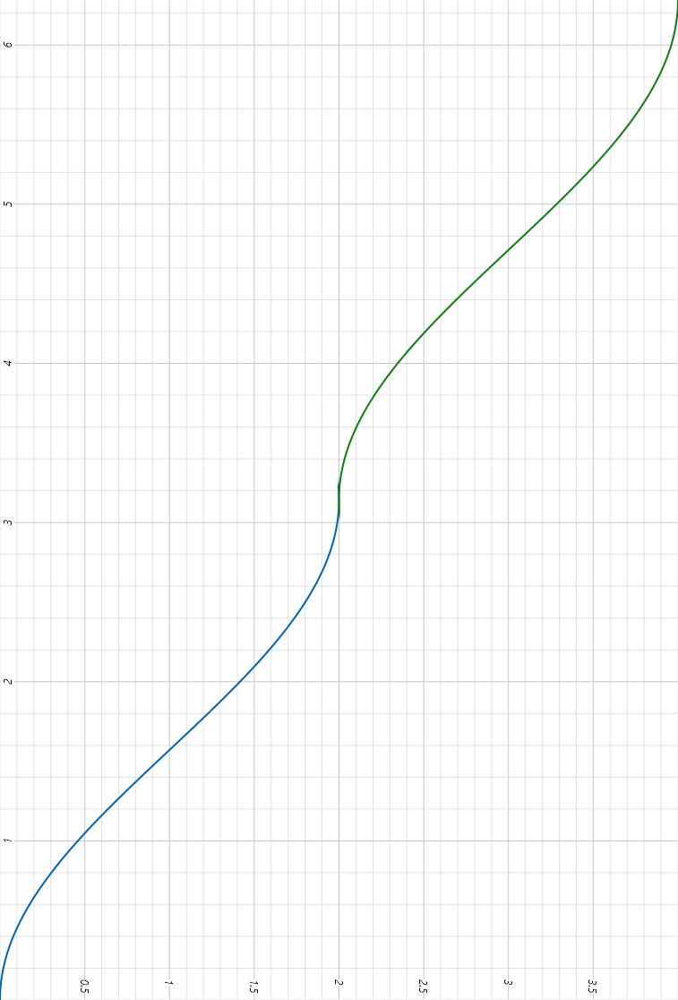
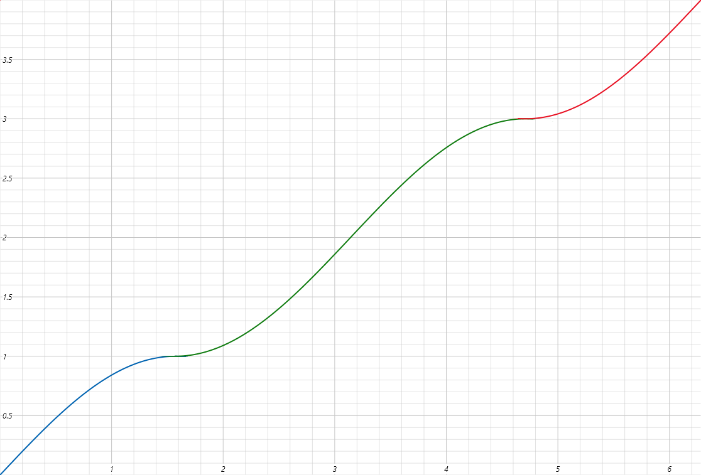
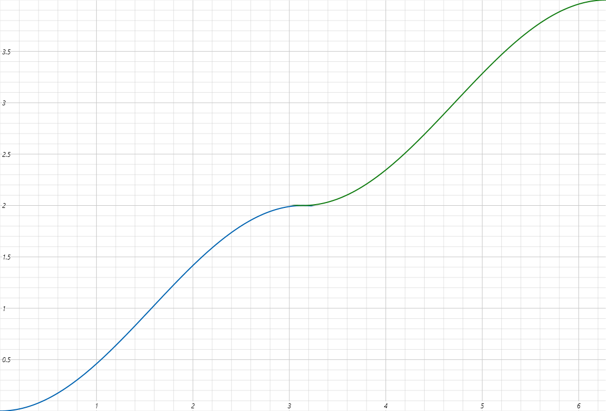

Algorithms
==========

Data structures
---------------

Define some data for algorithm.

.. doxygenclass:: bimpp::plan2d::algorithm::wall_ex
   :members:

.. doxygenclass:: bimpp::plan2d::algorithm::node_ex
   :members:

.. doxygenclass:: bimpp::plan2d::algorithm::room_ex
   :members:

.. doxygenenum:: bimpp::plan2d::algorithm::room_side

Functions
---------

They implement some algorithms that.

.. doxygenfunction:: bimpp::plan2d::algorithm::isContainsForBiggerVector

.. doxygenfunction:: bimpp::plan2d::algorithm::calculateAngleEx

.. doxygenfunction:: bimpp::plan2d::algorithm::calculateSinAngleEx

.. doxygenfunction:: bimpp::plan2d::algorithm::calculateCosAngleEx

.. doxygenfunction:: bimpp::plan2d::algorithm::computeRoomExs
